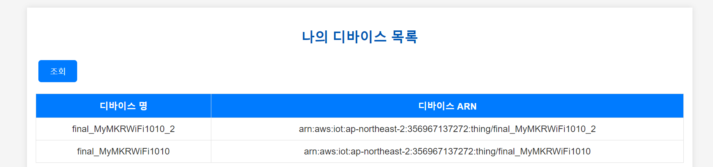
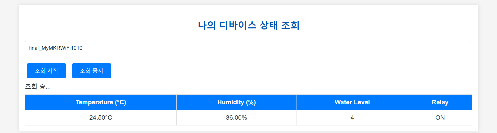
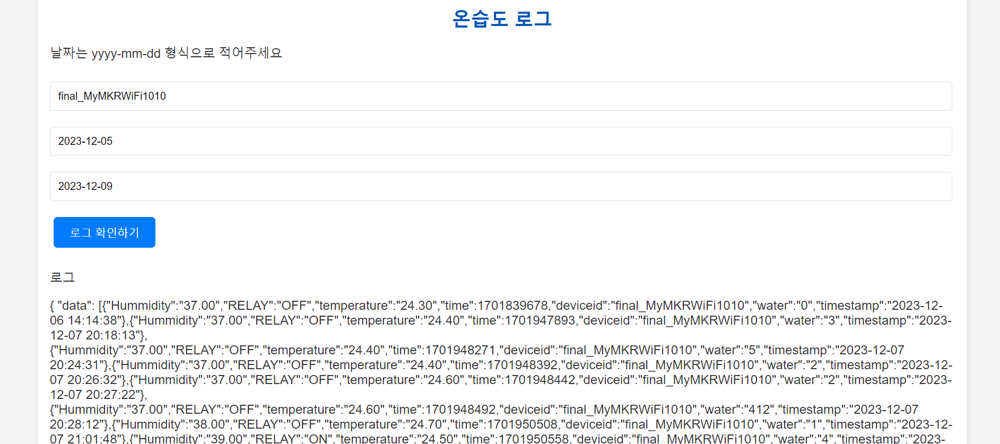
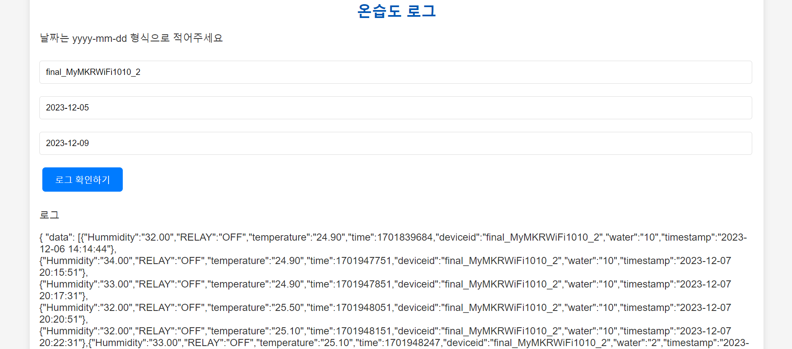
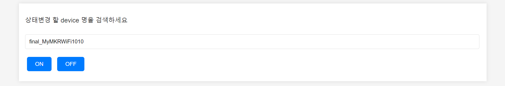

# SmartHumidifier IoT 클라우드 플랫폼

이 프로젝트는 스마트 가습기를 위한 IoT 클라우드 플랫폼을 구축하는 것을 목표로 합니다. 아래는 프로젝트의 주요 기능 목록입니다.

## 기능 목록

### 1. 디바이스 목록 조회

현재 등록된 디바이스 이름과 ARN을 조회할 수 있습니다.

### 2. 디바이스 현재 상태 조회

현재 등록된 디바이스의 상태를 조회할 수 있습니다.
* 조회 가능 센서 데이터
  * Temperature(°C) - 현재 온도
  * Humidity(%) - 현재 습도
  * Water Level - 현재 가습기 내부 잔여 수위
  * RELAY - 현재 가습기의 작동 상태(ON/OFF)

### 3. 디바이스 로그 조회

디바이스의 로그를 조회하고, 이미지 캡션을 통해 각 로그에 대한 설명을 제공합니다.

### 4. 디바이스 상태 변경

디바이스의 상태를 변경할 수 있는 기능을 제공합니다.

## 프로젝트 정보

- 작성자: [이름]
- 이메일: [이메일 주소]
- GitHub: [GitHub 프로젝트 링크]
- 라이센스: [프로젝트 라이센스 정보]

더 자세한 정보와 프로젝트에 기여하는 방법은 [GitHub 프로젝트 링크]에서 확인하실 수 있습니다.
