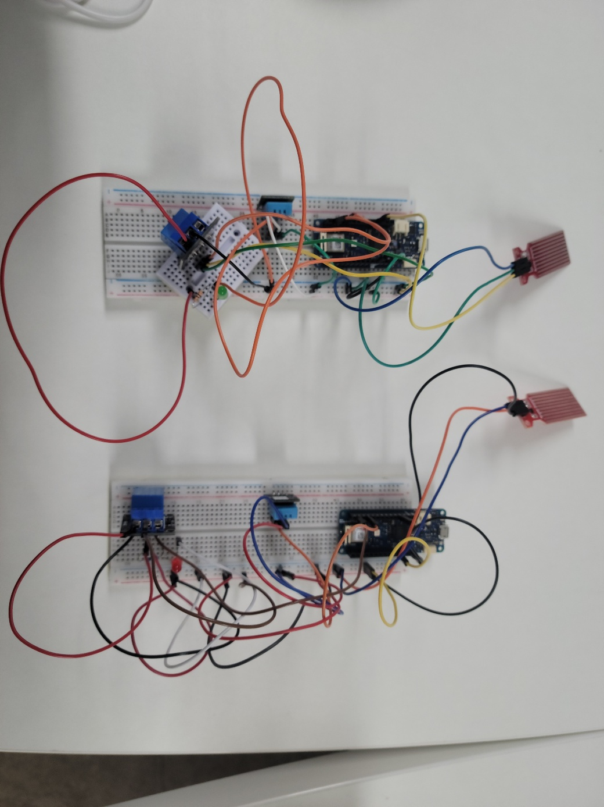

# SmartHumidifier IoT 클라우드 플랫폼

  <!-- Adjust the width as needed -->

이 프로젝트는 AWS와 아두이노를 사용하여 지능형 가습기를 구축합니다. 이 가습기는 환경의 습도와 가습기의 물 잔량을 모니터링하고, 이를 기반으로 자동으로 작동하거나 사용자에게 경고 이메일을 보내는 기능을 포함합니다.

## 주요 기능

### 경고 이메일 발송
- **기능 설명**: 가습기의 습도 또는 물 잔량이 설정된 임계값 이하로 떨어지면, 시스템은 사용자에게 경고 이메일을 자동으로 발송합니다.
- **기술적 세부사항**: 이메일 발송은 AWS의 이메일 서비스(Simple Email Service)를 사용하여 구현됩니다.

### 자동 가습기 작동
- **기능 설명**: 환경 습도가 설정된 임계값 이하로 떨어질 경우, 가습기는 자동으로 작동하여 습도를 적정 수준으로 유지합니다.
- **기술적 세부사항**: 아두이노 센서를 통해 실시간으로 습도를 모니터링하고, 조건에 따라 가습기를 제어합니다.

### 웹 인터페이스
- **기능 설명**: 사용자는 웹 인터페이스를 통해 가습기를 원격으로 켜고 끌 수 있습니다.
- **기술적 세부사항**: 웹 인터페이스는 사용자가 가습기의 상태를 확인하고 제어할 수 있는 사용자 친화적인 인터페이스를 제공합니다.

### 디바이스 관리 및 모니터링
- **기능 설명**: 사용자는 웹 인터페이스를 통해 가습기의 목록을 조회하고, 각 가습기의 현재 상태 및 로그를 확인할 수 있습니다.
- **기술적 세부사항**: 디바이스의 상태 정보 및 로그는 AWS 클라우드에 저장되며, 웹 인터페이스를 통해 실시간으로 액세스할 수 있습니다.

--------------------------

### 1. 디바이스 목록 조회

현재 등록된 디바이스 이름과 ARN을 조회할 수 있습니다.

### 2. 디바이스 현재 상태 조회

현재 등록된 디바이스의 상태를 조회할 수 있습니다.
* 조회 가능 센서 데이터
  * Temperature(°C) - 현재 온도
  * Humidity(%) - 현재 습도
  * Water Level - 현재 가습기 내부 잔여 수위
  * RELAY - 현재 가습기의 작동 상태(ON/OFF)

### 3. 디바이스 로그 조회

디바이스의 로그를 조회하고, 이미지 캡션을 통해 각 로그에 대한 설명을 제공합니다.

### 4. 디바이스 상태 변경

디바이스의 상태를 변경할 수 있는 기능을 제공합니다.

## 프로젝트 정보

- 작성자: [이주형1, 이동욱2]
- 이메일: [1wngud1798@hansung.ac.kr, 
21971455@hansung.ac.kr]
